Clustering Countries by Gender Inequality
================
Andre Stephens

-   [Examining the Data](#examining-the-data)
    -   [Setup](#setup)
    -   [Descriptives](#descriptives)
    -   [Simple Diagnostics](#simple-diagnostics)
        -   [Correlation Analysis](#correlation-analysis)
        -   [Bivariate Plot Analysis](#bivariate-plot-analysis)
-   [Clustering](#clustering)
    -   [K-means Clustering](#k-means-clustering)
        -   [Determining k](#determining-k)
        -   [Model](#model)
    -   [Kernel Density Estimation](#kernel-density-estimation)
    -   [Comparing K-Means with KDE](#comparing-k-means-with-kde)
        -   [Low Inequality](#low-inequality)
        -   [Medium Inequality](#medium-inequality)
        -   [High Inequality](#high-inequality)
    -   [Hierarchical Clustering](#hierarchical-clustering)

Examining the Data
==================

Setup
-----

We will load required packages.

``` r
# required packages
library(xtable)
library(car)
library(corrplot)
library(cluster)
library(fpc)
library(pastecs)
library(dendextend)
library(circlize)
set.seed(123)
```

Descriptives
------------

The data consist of gender inequality-related variables from 146 countries presented in the 2012 UN Human Development Report.

``` r
# import data file
gender  <-  read.csv("gender_data.csv",header=TRUE)  #import csv file
rownames(gender) <- gender$Country
gender <- gender[-c(1)]
names(gender) <- c("GII.rank", "GII.val", "Mat.mort.ratio", "Ado.fert.rate","pct.parl.seats.Fem", "pct.sec.ed.Fem", "pct.sec.ed.Male", "labor.force.part.Fem", "labor.force.part.Male", "pct.contracept", "pct.antenatal.care", "pct.birth.by.prof", "Tot.fert.rate")
head(gender)
```

    ##               GII.rank GII.val Mat.mort.ratio Ado.fert.rate
    ## Norway               6   0.075              7           9.0
    ## Australia           18   0.136              8          16.5
    ## Netherlands          2   0.052              9           5.1
    ## United States       47   0.299             24          41.2
    ## New Zealand         32   0.195             14          30.9
    ## Canada              20   0.140             12          14.0
    ##               pct.parl.seats.Fem pct.sec.ed.Fem pct.sec.ed.Male
    ## Norway                      39.6           99.3            99.1
    ## Australia                   28.3           95.1            97.2
    ## Netherlands                 37.8           86.3            89.2
    ## United States               16.8           95.3            94.5
    ## New Zealand                 33.6           71.6            73.5
    ## Canada                      24.9           92.3            92.7
    ##               labor.force.part.Fem labor.force.part.Male pct.contracept
    ## Norway                        63.0                  71.0             88
    ## Australia                     58.4                  72.2             71
    ## Netherlands                   59.5                  72.9             69
    ## United States                 58.4                  71.9             73
    ## New Zealand                   61.8                  75.7             75
    ## Canada                        62.7                  73.0             74
    ##               pct.antenatal.care pct.birth.by.prof Tot.fert.rate
    ## Norway                        NA                NA           2.0
    ## Australia                    100               100           2.0
    ## Netherlands                   NA               100           1.8
    ## United States                 NA                99           2.1
    ## New Zealand                   95               100           2.1
    ## Canada                        NA                98           1.7

The dataset include these variables:

<table>
<thead>
<tr>
<th style="text-align:left;">
Variable\_Code
</th>
<th style="text-align:left;">
Variable\_Name
</th>
</tr>
</thead>
<tbody>
<tr>
<td style="text-align:left;">
GII.rank
</td>
<td style="text-align:left;">
Gender Inequality ranking
</td>
</tr>
<tr>
<td style="text-align:left;">
GII.val
</td>
<td style="text-align:left;">
Gender Inequality value
</td>
</tr>
<tr>
<td style="text-align:left;">
Mat.mort.ratio
</td>
<td style="text-align:left;">
Maternal Mortality Rate
</td>
</tr>
<tr>
<td style="text-align:left;">
Ado.fert.rate
</td>
<td style="text-align:left;">
Adolescent Fertility Rate
</td>
</tr>
<tr>
<td style="text-align:left;">
pct.parl.seats.Fem
</td>
<td style="text-align:left;">
Percent of Female-Held Parliament Seats
</td>
</tr>
<tr>
<td style="text-align:left;">
pct.sec.ed.Fem
</td>
<td style="text-align:left;">
Percent of Females with a Secondary Education
</td>
</tr>
<tr>
<td style="text-align:left;">
pct.sec.ed.Male
</td>
<td style="text-align:left;">
Percent of Males with a Secondary Education
</td>
</tr>
<tr>
<td style="text-align:left;">
labor.force.part.Fem
</td>
<td style="text-align:left;">
Percent of Working-Age Females in the Labour Force
</td>
</tr>
<tr>
<td style="text-align:left;">
labor.force.part.Male
</td>
<td style="text-align:left;">
Percent of Working-Age Males in the Labour Force
</td>
</tr>
<tr>
<td style="text-align:left;">
pct.contracept
</td>
<td style="text-align:left;">
Percent of Individuals with Access to Contraception
</td>
</tr>
<tr>
<td style="text-align:left;">
pct.antenatal.care
</td>
<td style="text-align:left;">
Percent of Pregnant Women Receiving Antenatal Care (at least one visit)
</td>
</tr>
<tr>
<td style="text-align:left;">
pct.birth.by.prof
</td>
<td style="text-align:left;">
Percent of Births Involving Skilled Professional
</td>
</tr>
<tr>
<td style="text-align:left;">
Tot.fert.rate
</td>
<td style="text-align:left;">
Total Fertility Rate
</td>
</tr>
</tbody>
</table>
Here are some summary stats.

``` r
summary(gender)
```

    ##     GII.rank         GII.val       Mat.mort.ratio   Ado.fert.rate   
    ##  Min.   :  1.00   Min.   :0.0490   Min.   :   2.0   Min.   :  0.70  
    ##  1st Qu.: 37.25   1st Qu.:0.2303   1st Qu.:  18.0   1st Qu.: 16.50  
    ##  Median : 73.50   Median :0.4185   Median :  68.0   Median : 39.35  
    ##  Mean   : 73.50   Mean   :0.3942   Mean   : 211.2   Mean   : 51.81  
    ##  3rd Qu.:109.75   3rd Qu.:0.5450   3rd Qu.: 320.0   3rd Qu.: 74.38  
    ##  Max.   :146.00   Max.   :0.7690   Max.   :1400.0   Max.   :207.10  
    ##  NA's   :48       NA's   :48       NA's   :23                       
    ##  pct.parl.seats.Fem pct.sec.ed.Fem  pct.sec.ed.Male labor.force.part.Fem
    ##  Min.   : 0.00      Min.   : 0.90   Min.   : 6.00   Min.   :13.80       
    ##  1st Qu.: 9.80      1st Qu.:24.93   1st Qu.:36.30   1st Qu.:45.10       
    ##  Median :16.80      Median :54.60   Median :56.05   Median :53.80       
    ##  Mean   :18.03      Mean   :50.37   Mean   :56.05   Mean   :53.02       
    ##  3rd Qu.:23.50      3rd Qu.:71.42   3rd Qu.:77.28   3rd Qu.:62.10       
    ##  Max.   :53.60      Max.   :99.30   Max.   :99.10   Max.   :91.00       
    ##  NA's   :6          NA's   :36      NA's   :36      NA's   :17          
    ##  labor.force.part.Male pct.contracept  pct.antenatal.care
    ##  Min.   :50.00         Min.   : 3.00   Min.   : 16.0     
    ##  1st Qu.:70.60         1st Qu.:32.00   1st Qu.: 84.0     
    ##  Median :76.70         Median :51.00   Median : 92.0     
    ##  Mean   :76.05         Mean   :48.97   Mean   : 86.9     
    ##  3rd Qu.:81.10         3rd Qu.:69.00   3rd Qu.: 97.0     
    ##  Max.   :93.00         Max.   :89.00   Max.   :100.0     
    ##  NA's   :17            NA's   :16      NA's   :44        
    ##  pct.birth.by.prof Tot.fert.rate  
    ##  Min.   :  6.00    Min.   :1.100  
    ##  1st Qu.: 62.00    1st Qu.:1.700  
    ##  Median : 95.00    Median :2.300  
    ##  Mean   : 79.99    Mean   :2.803  
    ##  3rd Qu.: 99.00    3rd Qu.:3.800  
    ##  Max.   :100.00    Max.   :6.900  
    ##  NA's   :18        NA's   :13

*There is a lot of missingness in the antenatal care column, so we will drop this variable later.*

Simple Diagnostics
------------------

### Correlation Analysis

We can use Pearson's r to determine the degree of correlations across variables.

``` r
corrmatrix <- cor(gender, use = "pairwise.complete.obs")
round(corrmatrix, 2)
```

    ##                       GII.rank GII.val Mat.mort.ratio Ado.fert.rate
    ## GII.rank                  1.00    1.00           0.73          0.80
    ## GII.val                   1.00    1.00           0.71          0.79
    ## Mat.mort.ratio            0.73    0.71           1.00          0.71
    ## Ado.fert.rate             0.80    0.79           0.71          1.00
    ## pct.parl.seats.Fem       -0.34   -0.36          -0.02         -0.04
    ## pct.sec.ed.Fem           -0.78   -0.77          -0.69         -0.63
    ## pct.sec.ed.Male          -0.72   -0.72          -0.63         -0.60
    ## labor.force.part.Fem      0.09    0.06           0.33          0.22
    ## labor.force.part.Male     0.57    0.57           0.43          0.46
    ## pct.contracept           -0.65   -0.64          -0.71         -0.50
    ## pct.antenatal.care       -0.53   -0.53          -0.61         -0.37
    ## pct.birth.by.prof        -0.76   -0.75          -0.80         -0.63
    ## Tot.fert.rate             0.77    0.76           0.82          0.79
    ##                       pct.parl.seats.Fem pct.sec.ed.Fem pct.sec.ed.Male
    ## GII.rank                           -0.34          -0.78           -0.72
    ## GII.val                            -0.36          -0.77           -0.72
    ## Mat.mort.ratio                     -0.02          -0.69           -0.63
    ## Ado.fert.rate                      -0.04          -0.63           -0.60
    ## pct.parl.seats.Fem                  1.00           0.10            0.06
    ## pct.sec.ed.Fem                      0.10           1.00            0.94
    ## pct.sec.ed.Male                     0.06           0.94            1.00
    ## labor.force.part.Fem                0.26          -0.09           -0.11
    ## labor.force.part.Male              -0.07          -0.53           -0.55
    ## pct.contracept                      0.17           0.57            0.55
    ## pct.antenatal.care                  0.04           0.50            0.41
    ## pct.birth.by.prof                  -0.06           0.75            0.65
    ## Tot.fert.rate                      -0.10          -0.69           -0.64
    ##                       labor.force.part.Fem labor.force.part.Male
    ## GII.rank                              0.09                  0.57
    ## GII.val                               0.06                  0.57
    ## Mat.mort.ratio                        0.33                  0.43
    ## Ado.fert.rate                         0.22                  0.46
    ## pct.parl.seats.Fem                    0.26                 -0.07
    ## pct.sec.ed.Fem                       -0.09                 -0.53
    ## pct.sec.ed.Male                      -0.11                 -0.55
    ## labor.force.part.Fem                  1.00                  0.37
    ## labor.force.part.Male                 0.37                  1.00
    ## pct.contracept                       -0.23                 -0.42
    ## pct.antenatal.care                    0.00                 -0.26
    ## pct.birth.by.prof                    -0.32                 -0.49
    ## Tot.fert.rate                         0.24                  0.50
    ##                       pct.contracept pct.antenatal.care pct.birth.by.prof
    ## GII.rank                       -0.65              -0.53             -0.76
    ## GII.val                        -0.64              -0.53             -0.75
    ## Mat.mort.ratio                 -0.71              -0.61             -0.80
    ## Ado.fert.rate                  -0.50              -0.37             -0.63
    ## pct.parl.seats.Fem              0.17               0.04             -0.06
    ## pct.sec.ed.Fem                  0.57               0.50              0.75
    ## pct.sec.ed.Male                 0.55               0.41              0.65
    ## labor.force.part.Fem           -0.23               0.00             -0.32
    ## labor.force.part.Male          -0.42              -0.26             -0.49
    ## pct.contracept                  1.00               0.48              0.64
    ## pct.antenatal.care              0.48               1.00              0.76
    ## pct.birth.by.prof               0.64               0.76              1.00
    ## Tot.fert.rate                  -0.74              -0.50             -0.76
    ##                       Tot.fert.rate
    ## GII.rank                       0.77
    ## GII.val                        0.76
    ## Mat.mort.ratio                 0.82
    ## Ado.fert.rate                  0.79
    ## pct.parl.seats.Fem            -0.10
    ## pct.sec.ed.Fem                -0.69
    ## pct.sec.ed.Male               -0.64
    ## labor.force.part.Fem           0.24
    ## labor.force.part.Male          0.50
    ## pct.contracept                -0.74
    ## pct.antenatal.care            -0.50
    ## pct.birth.by.prof             -0.76
    ## Tot.fert.rate                  1.00

``` r
corrplot(corrmatrix, method = "circle") #plot matrix
```

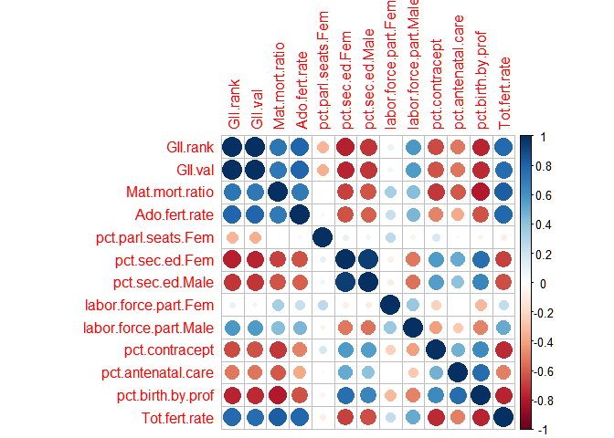

The visualization above represents the degree of the correlation of our gender inequality-related variables. The results suggest that the percent of females receiving post-secondary education is nearly perfectly correlated (r=0.94) with the percent of males. The gender inequality index (GII) rank is also perfectly correlated with the GII value due to the fact that the rank is simply a function of value. The correlation matrix below provides further confirmation of this.

The correlations suggest a number of interesting trends in this data.

-   Adolescent fertility is highly positively correlated with total fertility, suggesting that much of a country's birth rate relative to others can be explained by the birth rate among adolescents
-   Maternal mortality rate is highly positivelycorrelated with total/adolescent fertility, suggesting that countries with higher birth rates also tend to have higher numbers of maternal deaths
-   Maternal mortality rates also tend to be lower in countries where skilled professionals are involved in delivery (pct.birth.prof) and where access to contraception (pct.contracept) is higher
-   The percentage of females and males who receive at least a secondary education is strongly negatively correlated with total fertility and positively correlated with percentage births involving skilled professionals, implying that countries where women are highly educated tend to have lower birth rates and higher rates of professional care during childbirth. It is notable that these correlations are slightly stronger for higher rates of educated females than males.

*Note that these do not imply any causation.*

### Bivariate Plot Analysis

Excluding one of the highly-correlated variables and a few variables with low correlations (pct.parl.seats.Fem, labor.force.part.Fem), we can produce a scatterplot matrix of bivariate plots with fitted lines.

``` r
#scatterplot
formula <- ~Mat.mort.ratio+Ado.fert.rate+pct.sec.ed.Fem+labor.force.part.Fem+labor.force.part.Male+pct.contracept+pct.antenatal.care+pct.birth.by.prof+Tot.fert.rate
scatterplotMatrix(formula, upper.panel=panel.smooth, lwd=3, regLine = list(method=MASS::rlm, col="red", lwd=3), data=gender, main="Scatterplot Matrix of Gender Inequality Variables") 
```

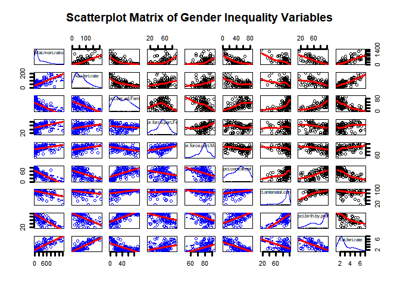

The fitted regression lines (smoothed lines shown in black-dotted plots) also indicate some interesting trends:

-   Total fertility rate grows exponentially with the labour force participation of men, suggesting that birth rates tend to grow a lot faster for countries where many working-age males are in the labour force as opposed to countries with fewer men in the labour force.

``` r
scatter.smooth(gender$Tot.fert.rate~gender$labor.force.part.Male, lpars=list(col="red", lwd=2), pch=3, col="darkgrey", ylab="Total Fertility Rate", xlab="Male Labour Force Participation")

sampled <- gender[sample(nrow(gender), 10), ]
text(sampled$Tot.fert.rate~sampled$labor.force.part.Male, labels=rownames(sampled), cex=0.7, font=2)
```


-   Maternal mortality grows exponentially with rise in labour force participation of women. This means that, that for countries with low female participation in the labour force, further increases in participation among women tend to have a relatively small effect on maternal deaths during childbirth. However, countries with high rates of female participation tend to see a much larger increase in maternal mortality when more women enter the workforce.

``` r
scatter.smooth(gender$Mat.mort.ratio~gender$labor.force.part.Fem, lpars=list(col="red", lwd=2), pch=3, col="darkgrey", ylab="Maternal Mortality Rate", xlab="Female Labour Force Participation")

sampled <- gender[sample(nrow(gender), 15), ]
text(sampled$Mat.mort.ratio~sampled$labor.force.part.Fem, labels=rownames(sampled), cex=0.7, font=2)
```

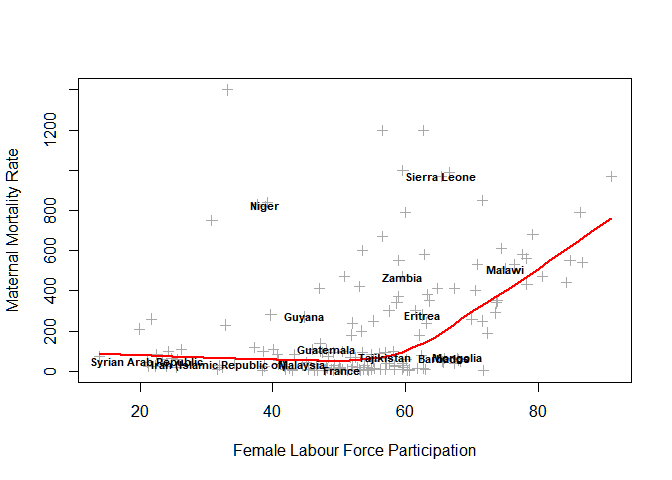

-   On the other hand, total fertility and adolescent fertility rates decay exponentially for countries with higher numbers of males and females with a secondary education. In other words, countries with a more educated population will tend to be associated with a more significant drop in birth rates as more people acquire education.

``` r
scatter.smooth(gender$Tot.fert.rate~gender$pct.sec.ed.Fem, lpars=list(col="red", lwd=2), pch=3, col="darkgrey", ylab="Total Fertility Rate", xlab="Percent Female with Secondary Education")

sampled <- gender[sample(nrow(gender), 15), ]
text(sampled$Tot.fert.rate~sampled$pct.sec.ed.Fem, labels=rownames(sampled), cex=0.7, font=2)
```

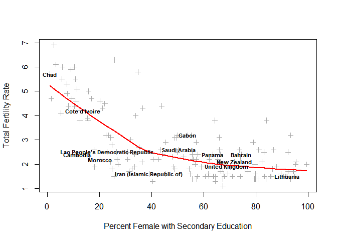

-   Finally, the association between total fertility and female labour force participation appears somewhat U-shaped. This implies that, for countires with low participation, more women entering the workforce tends to correlate with a relatively sharp decline in fertility whereas more women entering in a country with high participation tends to lead to a sharp increase in fertility.

``` r
scatter.smooth(gender$Tot.fert.rate~gender$labor.force.part.Fem, lpars=list(col="red", lwd=2), pch=3, col="darkgrey", ylab="Total Fertility Rate", xlab="Female Labour Force Participation")

sampled <- gender[sample(nrow(gender), 15), ]
text(sampled$Tot.fert.rate~sampled$labor.force.part.Fem, labels=rownames(sampled), cex=0.7, font=2)
```

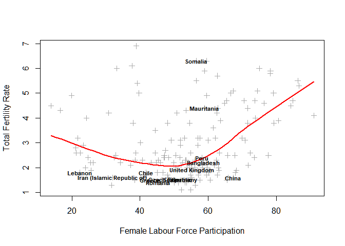

*Note that these do not imply any causation.*

Clustering
==========

We want to cluster the data to see if countries match distinct groups based on gender inequality metrics.

``` r
#subset data excluding UN index and antenatal care because of missingness
gender.subset <- subset(gender, select=-c(GII.rank,GII.val,pct.antenatal.care)) 
# standardize variables for comparability
gender.scaled <- scale(na.omit(gender.subset))
```

K-means Clustering
------------------

### Determining k

We will determine the optimal number of clusters using the Elbow and Gap Statistic methods.

#### Elbow Method

``` r
# Elbow method
set.seed(123)
# compute and plot wss for k = 2 to k = 16
k.max <- 15 # Maximal number of clusters

wss_func <- function(k){
  kmeans(gender.scaled, centers=k)$tot.withinss
}

within.sums <- sapply(1:k.max, wss_func)


plot(1:k.max, within.sums, type="b", 
      xlab="Number of clusters (k)",
      ylab="Within groups sum of squares",  
      main="Elbow Method for Determining K")
abline(v = 3, lty =2, col="red")
```

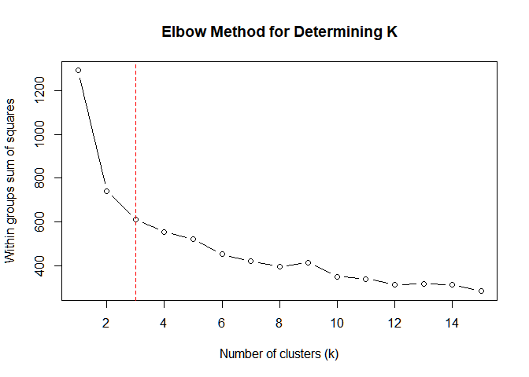

The results suggest that most of the within-group sum of squares is reduced at k=3.

#### Gap Statistic

``` r
# Compute gap statistic
gap_stat <- clusGap(gender.scaled, FUN=kmeans, K.max = k.max)

# Base plot of gap statistic
plot(gap_stat, frame = FALSE, xlab = "Number of clusters (k)",
     main="Gap Statistics Method for Determining K")
abline(v = 3, lty = 2)
```

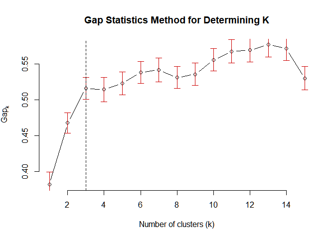

The gap statistic method suggests we choose k such that *G**a**p*(*k*)≥*G**a**p*(*k* + 1)−*s**e*<sub>*k* + 1</sub> using Tibshirani et al.'s (2001) suggestion.

``` r
print(gap_stat, method = "Tibs2001SEmax")
```

    ## Clustering Gap statistic ["clusGap"] from call:
    ## clusGap(x = gender.scaled, FUNcluster = kmeans, K.max = k.max)
    ## B=100 simulated reference sets, k = 1..15; spaceH0="scaledPCA"
    ##  --> Number of clusters (method 'Tibs2001SEmax', SE.factor=1): 3
    ##           logW   E.logW       gap     SE.sim
    ##  [1,] 4.895521 5.276919 0.3813983 0.01791756
    ##  [2,] 4.641930 5.109506 0.4675762 0.01434952
    ##  [3,] 4.530609 5.046488 0.5158793 0.01547325
    ##  [4,] 4.478520 4.992813 0.5142936 0.01703905
    ##  [5,] 4.429312 4.952221 0.5229087 0.01619584
    ##  [6,] 4.377925 4.915981 0.5380559 0.01543622
    ##  [7,] 4.343330 4.884902 0.5415720 0.01672597
    ##  [8,] 4.323320 4.854274 0.5309544 0.01522836
    ##  [9,] 4.291990 4.827604 0.5356134 0.01544358
    ## [10,] 4.246158 4.801892 0.5557337 0.01548886
    ## [11,] 4.210379 4.777992 0.5676123 0.01633395
    ## [12,] 4.185839 4.754903 0.5690638 0.01637862
    ## [13,] 4.155474 4.732158 0.5766841 0.01700896
    ## [14,] 4.140457 4.711625 0.5711685 0.01634322
    ## [15,] 4.160287 4.690194 0.5299076 0.01626962

These results confirm an optimal k of 3.

### Model

Using the `kmeans` function to cluster our gender data.

``` r
# generate clusters 
km <- kmeans(gender.scaled, 3, iter.max=1000000)

# plot solution 
clusplot(gender.scaled, km$cluster, color=TRUE, shade=TRUE, labels=2, cex.txt=0.35, cex=0, lines=0, 
         main="Gender Inequality Clusters (Country-level)")
```

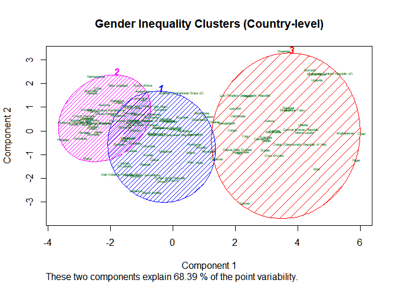

Kernel Density Estimation
-------------------------

We are interested in comparing how our k-means clusters assigns countries to groups based on gender-inequality-related variables as opposed to the Gender Inequality Index.

We will use Kernel Density Estimation for the univariate grouping of countries based on the GII.

``` r
# gii variable
gii <- na.omit(gender$GII.val)
# generate kde
kde <- density(gii, bw="SJ", from=0, to=0.8)#, adjust=0.9)

#calculate extrema
tp <- turnpoints(kde$y)

#plot
plot(kde, main="Kernel Density of Gender Inequality Index")
points(kde$x[tp$tppos],kde$y[tp$tppos],col=c("red","white","red"),pch=19)
abline(v=kde$x[tp$pits], col="red")
```

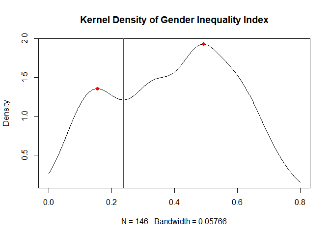

The estimation uses the recommended Sheather-Jones method for choosing bandwidth gives two local maxima and a local minimum. This suggests that the data can be reasonably classified into distinct groups. However, notice a slight dip in the density smooting at around x = 0.4 which might indicate a second minimum point for a narrower bandwith.

``` r
# generate kde with reduced bw
kde.rbw <- density(gii, bw="SJ", from=0, to=0.8, adjust=0.9)

#calculate extrema
tp.rbw <- turnpoints(kde.rbw$y)

#plot
plot(kde.rbw, main="Kernel Density of Gender Inequality Index (adj=0.9)")
points(kde.rbw$x[tp.rbw$tppos],
       kde.rbw$y[tp.rbw$tppos],
       col=c("red","white","red","white","red"),pch=19)
abline(v=kde.rbw$x[tp.rbw$pits], col="red")
```

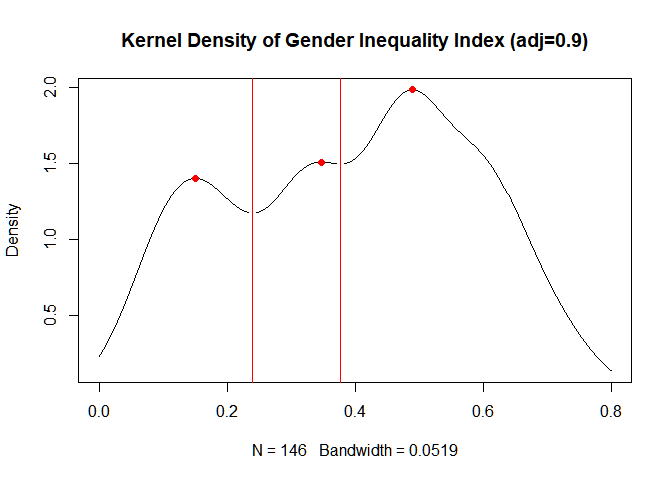

With just a small decrease in bandwith using the Sheather-Jones method, our density now contains two local minima. Given the slight change and the results of our k-means tests for determining k, it seems reasonable to relax some degree of smoothness in favour of more variability.

``` r
# generate kde with reduced bw
minima <- kde.rbw$x[tp.rbw$pits]
minima
```

    ## [1] 0.2395303 0.3772994

The density estimations suggests that we can divide countries into three groups:

1.  low inequality (0 &lt; *g**i**i* ≤ 0.2395)
2.  medium inequality (0.2395 &lt; *g**i**i* ≤ 0.3773)
3.  high inequality (0.3773 &lt; *g**i**i* ≤ 0.8)

Comparing K-Means with KDE
--------------------------

``` r
# get names func
get.rnames <- function(df){
  df %>%
    rownames %>%
    sort
}

# kde groups
low_kde <- get.rnames(gender[which(gender$GII.val<=minima[1]),])
med_kde <- get.rnames(gender[which(
  gender$GII.val<=minima[2]&gender$GII.val>minima[1]),])
hi_kde <- get.rnames(gender[which(gender$GII.val>minima[2]),])

# km clusters
low_km <- sort(names(km$cluster[km$cluster==2]))
med_km <- sort(names(km$cluster[km$cluster==1]))
hi_km <- sort(names(km$cluster[km$cluster==3]))

# pad with whitespace
paddr <- function(kde,km){
  inter <- kde[kde %in% km]
  kde <- kde[!kde %in% km]
  km <- km[!km %in% inter]
  max.len <- max(length(kde),length(km),length(inter))
  kde <- c(kde, rep(" ", max.len - length(kde)))  
  km <- c(km, rep(" ", max.len - length(km)))
  inter <- c(inter, rep(" ", max.len - length(inter)))
  data.frame(Both=inter, KDE_only=kde, Kmeans_only=km)
}
```

### Low Inequality

<table>
<thead>
<tr>
<th style="text-align:left;">
Both
</th>
<th style="text-align:left;">
KDE\_only
</th>
<th style="text-align:left;">
Kmeans\_only
</th>
</tr>
</thead>
<tbody>
<tr>
<td style="text-align:left;">
Australia
</td>
<td style="text-align:left;">
Belgium
</td>
<td style="text-align:left;">
Albania
</td>
</tr>
<tr>
<td style="text-align:left;">
Austria
</td>
<td style="text-align:left;">
Croatia
</td>
<td style="text-align:left;">
Armenia
</td>
</tr>
<tr>
<td style="text-align:left;">
Canada
</td>
<td style="text-align:left;">
Cyprus
</td>
<td style="text-align:left;">
Azerbaijan
</td>
</tr>
<tr>
<td style="text-align:left;">
China
</td>
<td style="text-align:left;">
Denmark
</td>
<td style="text-align:left;">
Barbados
</td>
</tr>
<tr>
<td style="text-align:left;">
Czech Republic
</td>
<td style="text-align:left;">
Finland
</td>
<td style="text-align:left;">
Botswana
</td>
</tr>
<tr>
<td style="text-align:left;">
Estonia
</td>
<td style="text-align:left;">
Germany
</td>
<td style="text-align:left;">
Bulgaria
</td>
</tr>
<tr>
<td style="text-align:left;">
France
</td>
<td style="text-align:left;">
Greece
</td>
<td style="text-align:left;">
Chile
</td>
</tr>
<tr>
<td style="text-align:left;">
Hungary
</td>
<td style="text-align:left;">
Iceland
</td>
<td style="text-align:left;">
Cuba
</td>
</tr>
<tr>
<td style="text-align:left;">
Ireland
</td>
<td style="text-align:left;">
Israel
</td>
<td style="text-align:left;">
Jamaica
</td>
</tr>
<tr>
<td style="text-align:left;">
Japan
</td>
<td style="text-align:left;">
Italy
</td>
<td style="text-align:left;">
Kazakhstan
</td>
</tr>
<tr>
<td style="text-align:left;">
Korea (Republic of)
</td>
<td style="text-align:left;">
Kuwait
</td>
<td style="text-align:left;">
Kyrgyzstan
</td>
</tr>
<tr>
<td style="text-align:left;">
Latvia
</td>
<td style="text-align:left;">
Luxembourg
</td>
<td style="text-align:left;">
Malta
</td>
</tr>
<tr>
<td style="text-align:left;">
Lithuania
</td>
<td style="text-align:left;">
Norway
</td>
<td style="text-align:left;">
Moldova (Republic of)
</td>
</tr>
<tr>
<td style="text-align:left;">
Netherlands
</td>
<td style="text-align:left;">
Portugal
</td>
<td style="text-align:left;">
Mongolia
</td>
</tr>
<tr>
<td style="text-align:left;">
New Zealand
</td>
<td style="text-align:left;">
Spain
</td>
<td style="text-align:left;">
Peru
</td>
</tr>
<tr>
<td style="text-align:left;">
Poland
</td>
<td style="text-align:left;">
Sweden
</td>
<td style="text-align:left;">
Romania
</td>
</tr>
<tr>
<td style="text-align:left;">
Singapore
</td>
<td style="text-align:left;">
Switzerland
</td>
<td style="text-align:left;">
Russian Federation
</td>
</tr>
<tr>
<td style="text-align:left;">
Slovakia
</td>
<td style="text-align:left;">
The former Yugoslav Republic of Macedonia
</td>
<td style="text-align:left;">
South Africa
</td>
</tr>
<tr>
<td style="text-align:left;">
Slovenia
</td>
<td style="text-align:left;">
United Arab Emirates
</td>
<td style="text-align:left;">
Tajikistan
</td>
</tr>
<tr>
<td style="text-align:left;">
United Kingdom
</td>
<td style="text-align:left;">
</td>
<td style="text-align:left;">
Trinidad and Tobago
</td>
</tr>
<tr>
<td style="text-align:left;">
</td>
<td style="text-align:left;">
</td>
<td style="text-align:left;">
Ukraine
</td>
</tr>
<tr>
<td style="text-align:left;">
</td>
<td style="text-align:left;">
</td>
<td style="text-align:left;">
United States
</td>
</tr>
</tbody>
</table>
### Medium Inequality

<table>
<thead>
<tr>
<th style="text-align:left;">
Both
</th>
<th style="text-align:left;">
KDE\_only
</th>
<th style="text-align:left;">
Kmeans\_only
</th>
</tr>
</thead>
<tbody>
<tr>
<td style="text-align:left;">
Argentina
</td>
<td style="text-align:left;">
Albania
</td>
<td style="text-align:left;">
Algeria
</td>
</tr>
<tr>
<td style="text-align:left;">
Bahamas
</td>
<td style="text-align:left;">
Armenia
</td>
<td style="text-align:left;">
Belize
</td>
</tr>
<tr>
<td style="text-align:left;">
Bahrain
</td>
<td style="text-align:left;">
Azerbaijan
</td>
<td style="text-align:left;">
Bhutan
</td>
</tr>
<tr>
<td style="text-align:left;">
Costa Rica
</td>
<td style="text-align:left;">
Barbados
</td>
<td style="text-align:left;">
Bolivia (Plurinational State of)
</td>
</tr>
<tr>
<td style="text-align:left;">
Libyan Arab Jamahiriya
</td>
<td style="text-align:left;">
Bulgaria
</td>
<td style="text-align:left;">
Brazil
</td>
</tr>
<tr>
<td style="text-align:left;">
Malaysia
</td>
<td style="text-align:left;">
Chile
</td>
<td style="text-align:left;">
Colombia
</td>
</tr>
<tr>
<td style="text-align:left;">
Maldives
</td>
<td style="text-align:left;">
Cuba
</td>
<td style="text-align:left;">
Dominican Republic
</td>
</tr>
<tr>
<td style="text-align:left;">
Mauritius
</td>
<td style="text-align:left;">
Kazakhstan
</td>
<td style="text-align:left;">
Ecuador
</td>
</tr>
<tr>
<td style="text-align:left;">
Oman
</td>
<td style="text-align:left;">
Kyrgyzstan
</td>
<td style="text-align:left;">
El Salvador
</td>
</tr>
<tr>
<td style="text-align:left;">
Tunisia
</td>
<td style="text-align:left;">
Malta
</td>
<td style="text-align:left;">
Gabon
</td>
</tr>
<tr>
<td style="text-align:left;">
Uruguay
</td>
<td style="text-align:left;">
Moldova (Republic of)
</td>
<td style="text-align:left;">
Georgia
</td>
</tr>
<tr>
<td style="text-align:left;">
Viet Nam
</td>
<td style="text-align:left;">
Romania
</td>
<td style="text-align:left;">
Guyana
</td>
</tr>
<tr>
<td style="text-align:left;">
</td>
<td style="text-align:left;">
Russian Federation
</td>
<td style="text-align:left;">
Honduras
</td>
</tr>
<tr>
<td style="text-align:left;">
</td>
<td style="text-align:left;">
Tajikistan
</td>
<td style="text-align:left;">
India
</td>
</tr>
<tr>
<td style="text-align:left;">
</td>
<td style="text-align:left;">
Trinidad and Tobago
</td>
<td style="text-align:left;">
Indonesia
</td>
</tr>
<tr>
<td style="text-align:left;">
</td>
<td style="text-align:left;">
Ukraine
</td>
<td style="text-align:left;">
Iran (Islamic Republic of)
</td>
</tr>
<tr>
<td style="text-align:left;">
</td>
<td style="text-align:left;">
United States
</td>
<td style="text-align:left;">
Iraq
</td>
</tr>
<tr>
<td style="text-align:left;">
</td>
<td style="text-align:left;">
</td>
<td style="text-align:left;">
Jordan
</td>
</tr>
<tr>
<td style="text-align:left;">
</td>
<td style="text-align:left;">
</td>
<td style="text-align:left;">
Kuwait
</td>
</tr>
<tr>
<td style="text-align:left;">
</td>
<td style="text-align:left;">
</td>
<td style="text-align:left;">
Lebanon
</td>
</tr>
<tr>
<td style="text-align:left;">
</td>
<td style="text-align:left;">
</td>
<td style="text-align:left;">
Mexico
</td>
</tr>
<tr>
<td style="text-align:left;">
</td>
<td style="text-align:left;">
</td>
<td style="text-align:left;">
Morocco
</td>
</tr>
<tr>
<td style="text-align:left;">
</td>
<td style="text-align:left;">
</td>
<td style="text-align:left;">
Myanmar
</td>
</tr>
<tr>
<td style="text-align:left;">
</td>
<td style="text-align:left;">
</td>
<td style="text-align:left;">
Namibia
</td>
</tr>
<tr>
<td style="text-align:left;">
</td>
<td style="text-align:left;">
</td>
<td style="text-align:left;">
Nicaragua
</td>
</tr>
<tr>
<td style="text-align:left;">
</td>
<td style="text-align:left;">
</td>
<td style="text-align:left;">
Pakistan
</td>
</tr>
<tr>
<td style="text-align:left;">
</td>
<td style="text-align:left;">
</td>
<td style="text-align:left;">
Paraguay
</td>
</tr>
<tr>
<td style="text-align:left;">
</td>
<td style="text-align:left;">
</td>
<td style="text-align:left;">
Philippines
</td>
</tr>
<tr>
<td style="text-align:left;">
</td>
<td style="text-align:left;">
</td>
<td style="text-align:left;">
Portugal
</td>
</tr>
<tr>
<td style="text-align:left;">
</td>
<td style="text-align:left;">
</td>
<td style="text-align:left;">
Qatar
</td>
</tr>
<tr>
<td style="text-align:left;">
</td>
<td style="text-align:left;">
</td>
<td style="text-align:left;">
Saudi Arabia
</td>
</tr>
<tr>
<td style="text-align:left;">
</td>
<td style="text-align:left;">
</td>
<td style="text-align:left;">
Sri Lanka
</td>
</tr>
<tr>
<td style="text-align:left;">
</td>
<td style="text-align:left;">
</td>
<td style="text-align:left;">
Swaziland
</td>
</tr>
<tr>
<td style="text-align:left;">
</td>
<td style="text-align:left;">
</td>
<td style="text-align:left;">
Syrian Arab Republic
</td>
</tr>
<tr>
<td style="text-align:left;">
</td>
<td style="text-align:left;">
</td>
<td style="text-align:left;">
Thailand
</td>
</tr>
<tr>
<td style="text-align:left;">
</td>
<td style="text-align:left;">
</td>
<td style="text-align:left;">
The former Yugoslav Republic of Macedonia
</td>
</tr>
<tr>
<td style="text-align:left;">
</td>
<td style="text-align:left;">
</td>
<td style="text-align:left;">
Turkey
</td>
</tr>
<tr>
<td style="text-align:left;">
</td>
<td style="text-align:left;">
</td>
<td style="text-align:left;">
United Arab Emirates
</td>
</tr>
<tr>
<td style="text-align:left;">
</td>
<td style="text-align:left;">
</td>
<td style="text-align:left;">
Venezuela (Bolivarian Republic of)
</td>
</tr>
<tr>
<td style="text-align:left;">
</td>
<td style="text-align:left;">
</td>
<td style="text-align:left;">
Zimbabwe
</td>
</tr>
</tbody>
</table>
### High Inequality

<table>
<thead>
<tr>
<th style="text-align:left;">
Both
</th>
<th style="text-align:left;">
KDE\_only
</th>
<th style="text-align:left;">
Kmeans\_only
</th>
</tr>
</thead>
<tbody>
<tr>
<td style="text-align:left;">
Afghanistan
</td>
<td style="text-align:left;">
Algeria
</td>
<td style="text-align:left;">
</td>
</tr>
<tr>
<td style="text-align:left;">
Bangladesh
</td>
<td style="text-align:left;">
Belize
</td>
<td style="text-align:left;">
</td>
</tr>
<tr>
<td style="text-align:left;">
Benin
</td>
<td style="text-align:left;">
Bhutan
</td>
<td style="text-align:left;">
</td>
</tr>
<tr>
<td style="text-align:left;">
Burkina Faso
</td>
<td style="text-align:left;">
Bolivia (Plurinational State of)
</td>
<td style="text-align:left;">
</td>
</tr>
<tr>
<td style="text-align:left;">
Burundi
</td>
<td style="text-align:left;">
Botswana
</td>
<td style="text-align:left;">
</td>
</tr>
<tr>
<td style="text-align:left;">
Cambodia
</td>
<td style="text-align:left;">
Brazil
</td>
<td style="text-align:left;">
</td>
</tr>
<tr>
<td style="text-align:left;">
Cameroon
</td>
<td style="text-align:left;">
Colombia
</td>
<td style="text-align:left;">
</td>
</tr>
<tr>
<td style="text-align:left;">
Central African Republic
</td>
<td style="text-align:left;">
Dominican Republic
</td>
<td style="text-align:left;">
</td>
</tr>
<tr>
<td style="text-align:left;">
Chad
</td>
<td style="text-align:left;">
Ecuador
</td>
<td style="text-align:left;">
</td>
</tr>
<tr>
<td style="text-align:left;">
Congo
</td>
<td style="text-align:left;">
El Salvador
</td>
<td style="text-align:left;">
</td>
</tr>
<tr>
<td style="text-align:left;">
Congo (Democratic Republic of the)
</td>
<td style="text-align:left;">
Gabon
</td>
<td style="text-align:left;">
</td>
</tr>
<tr>
<td style="text-align:left;">
Cote d'Ivoire
</td>
<td style="text-align:left;">
Georgia
</td>
<td style="text-align:left;">
</td>
</tr>
<tr>
<td style="text-align:left;">
Gambia
</td>
<td style="text-align:left;">
Guyana
</td>
<td style="text-align:left;">
</td>
</tr>
<tr>
<td style="text-align:left;">
Ghana
</td>
<td style="text-align:left;">
Honduras
</td>
<td style="text-align:left;">
</td>
</tr>
<tr>
<td style="text-align:left;">
Guatemala
</td>
<td style="text-align:left;">
India
</td>
<td style="text-align:left;">
</td>
</tr>
<tr>
<td style="text-align:left;">
Haiti
</td>
<td style="text-align:left;">
Indonesia
</td>
<td style="text-align:left;">
</td>
</tr>
<tr>
<td style="text-align:left;">
Kenya
</td>
<td style="text-align:left;">
Iran (Islamic Republic of)
</td>
<td style="text-align:left;">
</td>
</tr>
<tr>
<td style="text-align:left;">
Lao People's Democratic Republic
</td>
<td style="text-align:left;">
Iraq
</td>
<td style="text-align:left;">
</td>
</tr>
<tr>
<td style="text-align:left;">
Lesotho
</td>
<td style="text-align:left;">
Jamaica
</td>
<td style="text-align:left;">
</td>
</tr>
<tr>
<td style="text-align:left;">
Liberia
</td>
<td style="text-align:left;">
Jordan
</td>
<td style="text-align:left;">
</td>
</tr>
<tr>
<td style="text-align:left;">
Malawi
</td>
<td style="text-align:left;">
Lebanon
</td>
<td style="text-align:left;">
</td>
</tr>
<tr>
<td style="text-align:left;">
Mali
</td>
<td style="text-align:left;">
Mexico
</td>
<td style="text-align:left;">
</td>
</tr>
<tr>
<td style="text-align:left;">
Mauritania
</td>
<td style="text-align:left;">
Mongolia
</td>
<td style="text-align:left;">
</td>
</tr>
<tr>
<td style="text-align:left;">
Mozambique
</td>
<td style="text-align:left;">
Morocco
</td>
<td style="text-align:left;">
</td>
</tr>
<tr>
<td style="text-align:left;">
Nepal
</td>
<td style="text-align:left;">
Myanmar
</td>
<td style="text-align:left;">
</td>
</tr>
<tr>
<td style="text-align:left;">
Niger
</td>
<td style="text-align:left;">
Namibia
</td>
<td style="text-align:left;">
</td>
</tr>
<tr>
<td style="text-align:left;">
Papua New Guinea
</td>
<td style="text-align:left;">
Nicaragua
</td>
<td style="text-align:left;">
</td>
</tr>
<tr>
<td style="text-align:left;">
Rwanda
</td>
<td style="text-align:left;">
Pakistan
</td>
<td style="text-align:left;">
</td>
</tr>
<tr>
<td style="text-align:left;">
Senegal
</td>
<td style="text-align:left;">
Panama
</td>
<td style="text-align:left;">
</td>
</tr>
<tr>
<td style="text-align:left;">
Sierra Leone
</td>
<td style="text-align:left;">
Paraguay
</td>
<td style="text-align:left;">
</td>
</tr>
<tr>
<td style="text-align:left;">
Sudan
</td>
<td style="text-align:left;">
Peru
</td>
<td style="text-align:left;">
</td>
</tr>
<tr>
<td style="text-align:left;">
Tanzania (United Republic of)
</td>
<td style="text-align:left;">
Philippines
</td>
<td style="text-align:left;">
</td>
</tr>
<tr>
<td style="text-align:left;">
Togo
</td>
<td style="text-align:left;">
Qatar
</td>
<td style="text-align:left;">
</td>
</tr>
<tr>
<td style="text-align:left;">
Uganda
</td>
<td style="text-align:left;">
Saudi Arabia
</td>
<td style="text-align:left;">
</td>
</tr>
<tr>
<td style="text-align:left;">
Yemen
</td>
<td style="text-align:left;">
South Africa
</td>
<td style="text-align:left;">
</td>
</tr>
<tr>
<td style="text-align:left;">
Zambia
</td>
<td style="text-align:left;">
Sri Lanka
</td>
<td style="text-align:left;">
</td>
</tr>
<tr>
<td style="text-align:left;">
</td>
<td style="text-align:left;">
Swaziland
</td>
<td style="text-align:left;">
</td>
</tr>
<tr>
<td style="text-align:left;">
</td>
<td style="text-align:left;">
Syrian Arab Republic
</td>
<td style="text-align:left;">
</td>
</tr>
<tr>
<td style="text-align:left;">
</td>
<td style="text-align:left;">
Thailand
</td>
<td style="text-align:left;">
</td>
</tr>
<tr>
<td style="text-align:left;">
</td>
<td style="text-align:left;">
Turkey
</td>
<td style="text-align:left;">
</td>
</tr>
<tr>
<td style="text-align:left;">
</td>
<td style="text-align:left;">
Venezuela (Bolivarian Republic of)
</td>
<td style="text-align:left;">
</td>
</tr>
<tr>
<td style="text-align:left;">
</td>
<td style="text-align:left;">
Zimbabwe
</td>
<td style="text-align:left;">
</td>
</tr>
</tbody>
</table>
The results show a degree of difference in the grouping of countries (although the (inferred) ranking of countries in the two extreme groups of the k-means clusters appears to be somewhat similar to the KDE for many countries).

Hierarchical Clustering
-----------------------

Finally, we can compare these groupings to a dendrogram which clusters countries hierarchically, starting with each country and pairing it with its most similar neighbour.

``` r
# order alphabetically
gender.scaled <- gender.scaled[order(row.names(gender.scaled)), ]

# create a dendrogram
hc <- hclust(dist(gender.scaled))
dend <- as.dendrogram(hc)

# modify the dendrogram to have some colors in the branches and labels
dend <- dend %>% 
   color_branches(k=10) %>% 
   color_labels(k=10)

# plot the radial plot
par(cex = 0.6, mar = rep(0,4))
circlize_dendrogram(dend, edgePar=list(cex=0.3)) 
```

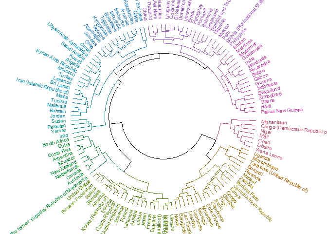

These results appear a bit more similar to the k-means clusters than to the KDE groups.
