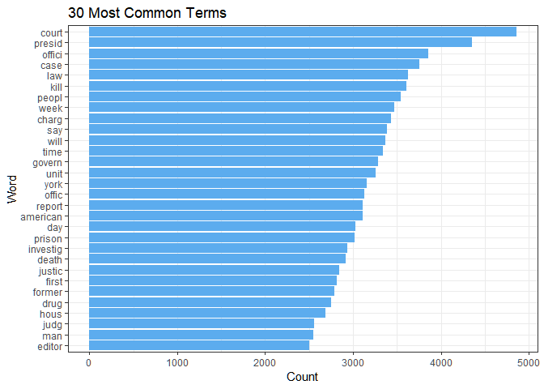
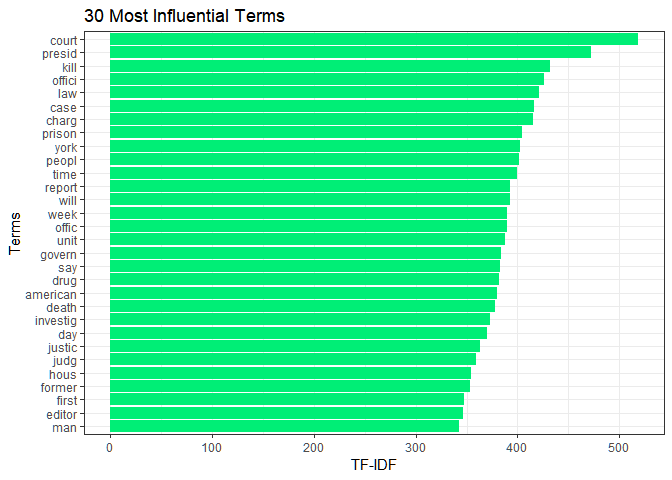
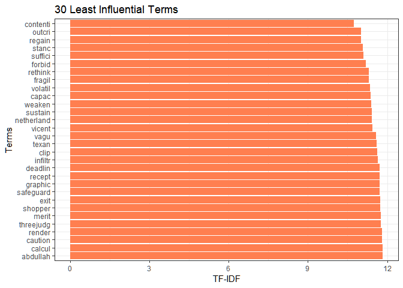

Generating Newspaper Topic Model
================
Andre Stephens
January 8, 2019

-   [Context](#context)
    -   [Problem](#problem)
    -   [Setting things up](#setting-things-up)
    -   [Text Processing](#text-processing)
        -   [Pre-processing](#pre-processing)
        -   [Examining Documents](#examining-documents)
        -   [Lemmatisation](#lemmatisation)
    -   [Analysing Terms](#analysing-terms)
        -   [Term Sparsity](#term-sparsity)
        -   [Term Counts](#term-counts)
        -   [Word Cloud](#word-cloud)
-   [LDA Model](#lda-model)
    -   [Specifications](#specifications)
    -   [Results](#results)

Context
=======

Problem
-------

We have a corpus of over 33,000 crime-related articles queried from the New York Times' API ranging from 1981 to 2013. We are interested in generating a model of crime-related topics based on the data. We will use the Latent Dirichlet Allocation (LDA) model to group words based on their probabality of belonging to a given topic. LDA assumes that each word in a text belongs to a given topic and that each document is generated from a set of topics. More information on LDA can be found in [Blei, Ng and Jordan 2003](http://www.jmlr.org/papers/volume3/blei03a/blei03a.pdf).

*Note that the API only returns the lead paragraph or abstract and the title. Therefore, articles are much shorterthan the actual printed articles*

Setting things up
-----------------

``` r
# required packages
library(rjson)
library(lda)
library(tm)
library(ggplot2)
library(reshape2)
library(topicmodels)
library(reticulate)
library(magrittr)
library(SnowballC)
library(udpipe)
library(wordcloud2)
knitr::knit_engines$set(python = reticulate::eng_python)
```

Text Processing
---------------

### Pre-processing

I happened to have the data from the NYT API stored (serialized) as a picke file, which can only be unpickled in using the Python module. We'll also do some pre-processing of the data since to get rid of unwanted control characters.

``` python
# get modules
import sys
import os
import html
import pickle
import json
import re
# returns pickle file as python object
def unpickle(fname):
    f = open(fname, 'rb')
    return pickle.load(f, encoding='utf-8')
    
f_bodies = "nytdata/bodies.pkl" 
f_titles = "nytdata/titles.pkl" 
bodies = unpickle(f_bodies) # load article texts
titles = unpickle(f_titles) # load article titles
re_contr = re.compile(r'[\n\r\t]')
re_label = re.compile(r'^[^a-z]*;\s')
# returns pre-processed string
def pre_process(a):
    a = html.unescape(a) # convert to unicode
    a = re_contr.sub(" ", a) # replace control chars
    a = re_label.sub("", a) # delete article type labels
    return a
articles = []
for a in zip(titles, bodies):
    a = ' '.join(a) # combine title with body
    a = pre_process(a) # pre-process
    articles.append(a)
# dump json file to be used in R
with open('nytdata/articles.json','w') as f:
    json.dump(articles, f)
```

### Examining Documents

In R, We can represent the data as a corpus using the `tm` package. We can also inspect the first few documents.

``` r
# read in articles from file
fjson <- "nytdata/articles.json"
nytarticles <- fromJSON(file=fjson)

# transform into a corpus and inspect
nytcorpus <- Corpus(VectorSource(nytarticles))
inspect(nytcorpus[1:5])
```

    ## <<SimpleCorpus>>
    ## Metadata:  corpus specific: 1, document level (indexed): 0
    ## Content:  documents: 5
    ## 
    ## [1] Juvenile Court Reform in Tennessee The juvenile justice system in the United States is supposed to focus on rehabilitation for young offenders. But for generations, it has largely been a purgatory, failing to protect them or give them the help and counseling they need to become law-abiding adults. Children who end up in juvenile courts often do not get due process protections like          
    ## [2] Clock Time and Sun Time Q. Is there a scientific reason that adopting year-round daylight saving time would not be feasible?   A. There is no reason that any time plan cannot be adopted by human beings, but whether year-round daylight saving time would achieve its chief goal — saving energy — is another question. A later sunset time leaves a shorter                                          
    ## [3] California: Man Held In Burning of Homeless Woman A 24-year-old Los Angeles man was charged Monday with attempted murder after a homeless woman was set on fire last week as she slept on a suburban bus bench, the district attorney’s office said. The suspect, Dennis Petillo, was scheduled to be arraigned in Superior Court on the attempted murder charge and on an additional count of aggravated
    ## [4] Seeking Answers In Genome Of Gunman In a move likely to renew a longstanding ethical controversy, geneticists are quietly making plans to study the DNA of Adam Lanza, 20, who killed 20 children and seven adults in Newtown, Conn. Their work will be an effort to discover biological clues to extreme violence.   The researchers, at the University of Connecticut, confirmed their                 
    ## [5] Out in Africa JOHANNESBURG   A few weeks ago I’d have told you that on the subject of equal rights for gays and lesbians — arguably the civil rights issue of our day — I was feeling pretty proud of my country. Gay equality is supported by swelling majorities in polls, especially among young Americans. We had an election in which, for

### Lemmatisation

We want to distinguish between words based on their meaning and not according to their morphological form. To do so, we want to only keep word stems. For example, we probably 'shoot','shooter','shooting' to be represented as the having the same word (having the same probability of belonging to a latent topic). We should also get rid of common words that, while part of the proper syntatic structure of an English sentence, don't convey much meaning by themselves (e.g. 'as', 'the', 'with', etc.).

``` r
processed_corpus <- nytcorpus %>% 
    tm_map(tolower) %>% # all characters lowercase
    tm_map(removePunctuation, ucp=TRUE) %>% # remove punctuation
    tm_map(removeNumbers) %>% # remove numbers
    tm_map(removeWords, stopwords("english")) %>% # remove stopwords
    tm_map(stripWhitespace) %>% # remove extra whitespaces
    tm_map(stemDocument) # stem words
```

Once again, we can inspect the corpus to see changes.

``` r
inspect(processed_corpus[1:5])
```

    ## <<SimpleCorpus>>
    ## Metadata:  corpus specific: 1, document level (indexed): 0
    ## Content:  documents: 5
    ## 
    ## [1] juvenil court reform tennesse juvenil justic system unit state suppos focus rehabilit young offend generat larg purgatori fail protect give help counsel need becom lawabid adult children end juvenil court often get due process protect like                               
    ## [2] clock time sun time q scientif reason adopt yearround daylight save time feasibl reason time plan adopt human be whether yearround daylight save time achiev chief goal save energi anoth question later sunset time leav shorter                                             
    ## [3] california man held burn homeless woman yearold los angel man charg monday attempt murder homeless woman set fire last week slept suburban bus bench district attorney offic said suspect denni petillo schedul arraign superior court attempt murder charg addit count aggrav
    ## [4] seek answer genom gunman move like renew longstand ethic controversi geneticist quiet make plan studi dna adam lanza kill children seven adult newtown conn work will effort discov biolog clue extrem violenc research univers connecticut confirm                           
    ## [5] africa johannesburg week ago id told subject equal right gay lesbian arguabl civil right issu day feel pretti proud countri gay equal support swell major poll especi among young american elect

Analysing Terms
---------------

### Term Sparsity

We can then convert the processed corpus into a document-term matrix. We have over 33,300 articles and close to 42,300 unique word stems. More than half of these word stems occur less than 3 times, however.

``` r
# create document-term matrix
dtm <- DocumentTermMatrix(processed_corpus)
dtm
```

    ## <<DocumentTermMatrix (documents: 33327, terms: 42293)>>
    ## Non-/sparse entries: 1073446/1408425365
    ## Sparsity           : 100%
    ## Maximal term length: 50
    ## Weighting          : term frequency (tf)

``` r
# quartiles for the distribution of word frequencies
summary(slam::col_sums(dtm)) 
```

    ##    Min. 1st Qu.  Median    Mean 3rd Qu.    Max. 
    ##    1.00    1.00    2.00   29.66    7.00 8402.00

To improve the time efficiency of the model, we will remove word stems that do not appear in at least 0.1% of documents. These words are too idiosyncratic to a document to yield information on the topic-word distributions. This considerably reduces the number of terms, even with the conservative threshold.

*A small threshold is desirable because our articles are quite short (around 50 words). We shouldn't expect them to share many words after removing stopwords.*

``` r
# does not appear in at least 0.1% of documents
dtm <- removeSparseTerms(dtm, 0.999)
dtm
```

    ## <<DocumentTermMatrix (documents: 33327, terms: 4004)>>
    ## Non-/sparse entries: 923970/132517338
    ## Sparsity           : 99%
    ## Maximal term length: 18
    ## Weighting          : term frequency (tf)

By a similar token, we can get rid of the most frequently-occuring words which are likely to be too general to help our model refine topics.

``` r
# removes terms occuring in frac or more of the documents
removeCommonTerms <- function (dtm, frac){
    transposed <- t(dtm)
    tab <- table(transposed$i) < transposed$ncol * (frac)
    index <- as.numeric(names(tab[tab]))
    dtm[, index]
}

# remove terms occuring in 10% or more of documents
dtm2 <- removeCommonTerms(dtm, 0.1)
dtm2
```

    ## <<DocumentTermMatrix (documents: 33327, terms: 3990)>>
    ## Non-/sparse entries: 856397/132118333
    ## Sparsity           : 99%
    ## Maximal term length: 18
    ## Weighting          : term frequency (tf)

### Term Counts

Our words are the only data we observe in the LDA model, so let's play with them a little. Below, we plot the most common words. We also plot the words with the highest and lowest td-idf. The td-idf is a sort of weighted statistic which accounts for how frequently a word appears in a document while discounting for the number of other documents that contain the word. It therefore gives us a sense of the degree of importance of the word to a particular document context.

We can see that the list of most common words is close to the most 'influential' words in the td-idf. However, this was not the case prior to removing frequent terms in the step above (not shown here).

``` r
# get frequency counts for words
freqs <- dtm2 %>%
  as.matrix() %>%
  colSums() %>%
  sort(decreasing = TRUE)

freqs <- data.frame(count=freqs, term=names(freqs))

# plot counts
ggplot(head(freqs, 30), aes(x=reorder(term, count), y=count)) +
  geom_bar(stat = "identity", fill="steelblue2") + 
  xlab("Word") + ylab("Count") + 
  ggtitle("30 Most Common Terms") +
  coord_flip() +
  theme_bw()
```



``` r
tfidf <- dtm2 %>%
  weightTfIdf() %>%
  as.matrix() %>%
  colSums() %>%
  sort(decreasing = TRUE)

tfidf <- data.frame(tfidf=tfidf, term=names(tfidf))

ggplot(head(tfidf, 30), aes(x=reorder(term, tfidf), y=tfidf)) + 
  geom_bar(stat = "identity", fill="springgreen2") + 
  xlab("Terms") + ylab("TF-IDF") + 
  ggtitle("30 Most Influential Terms") +
  coord_flip() +
  theme_bw()
```



``` r
ggplot(tail(tfidf, 30), 
       aes(x=reorder(term, -tfidf), y=tfidf)) + 
  geom_bar(stat = "identity", fill="coral") + 
  xlab("Terms") + ylab("TF-IDF") + 
  ggtitle("30 Least Influential Terms") +
  coord_flip() +
  theme_bw()
```



### Word Cloud

Finally, we can represent the word frequencies as word cloud. Word clouds are often not terribly informative... but they are pretty to look at!

``` r
tfidf$round <- sapply(tfidf$tfidf, round)
wordcloud2(tfidf[,c(2,1)], size=1.5)
```


LDA Model
=========

Specifications
--------------

We can used collapsed Gibbs sampler function for LDA to estimate our model latent parametres. However, we need to contrain the number of topics the model estimates by setting *K*. For the sake of example, I chose a *K* of 10. In practice, a systematic estimation on the number of topics -- such as the (hierarchical Dirichlet process) -- is probably most sophisticated approach. I also chose 100 iterations for the example, although this is certainly inadequate for convergence.

In addition to the number of topics, we need to specify two additional parameters, *α* and *η*. In a nutshell, our *α* specifies how similar documents are expected to be in terms of their topic distribution and our *η*, how similar topics are likely to be in terms of their terms (higher indicating more similarity). In our case, the data consist of short articles that summarize the main point of the story. We will assume that our documents to have a lower *α*, corresponding to a fairly distinct latent topical structure since they are quite short and focus on the facts of a given story. On the other hand, we speculate that the *η* should be larger since crime-related topics probably share a fair bit of common words.

``` r
#convert to Blei's lda-c format 
lda <- dtm2ldaformat(dtm2)

#write function for lda operation 
get_topics <- function(x, K, a){
  system.time(result  <- lda.collapsed.gibbs.sampler(x$documents, 
    K, 
    x$vocab, 
    100, 
    alpha = a + log(length(lda$documents))*0.1, 
    eta = log(K) 
    ))
  result
} 

set.seed(123)
model <- get_topics(lda, 10, 0.1)
```

Results
-------

We retrieve the 10 most likely words from our model of 10 topics. It is always tempting to impose meaning onto the latent topics, and we won't resist the urge here. But it is important to point out that we leave the realm of computation and enter the world of speculation. Still, I was pleasantly surprised that the topics appeared so readily interpetable given a number of factors: 1) the relatively small number of words in each documents to the number of documents, 2) the likely word similarity in a set of articles about crime, 3) the small number of iterations and somewhat haphazard specification.

``` r
# get first 10 topics
topwords <- top.topic.words(model$topics, 10, by.score = TRUE) 
```

    ## Warning: package 'xtable' was built under R version 3.5.2

<!-- html table generated in R 3.5.1 by xtable 1.8-3 package -->
<!-- Tue Jan 15 14:32:35 2019 -->
<table border="1">
<tr>
<th>
</th>
<th>
COURTS
</th>
<th>
DRUG CRIMES
</th>
<th>
MASS SHOOTINGS
</th>
<th>
CRIME SCENE
</th>
<th>
LEGISLATION
</th>
<th>
FOREIGN POLICY
</th>
<th>
WHITE-COLLAR
</th>
<th>
VIOLENT CRIMES
</th>
<th>
POLITICS
</th>
<th>
OTHER?
</th>
</tr>
<tr>
<td align="right">
1
</td>
<td>
court
</td>
<td>
drug
</td>
<td>
school
</td>
<td>
street
</td>
<td>
editor
</td>
<td>
american
</td>
<td>
investig
</td>
<td>
kill
</td>
<td>
presid
</td>
<td>
time
</td>
</tr>
<tr>
<td align="right">
2
</td>
<td>
judg
</td>
<td>
report
</td>
<td>
die
</td>
<td>
town
</td>
<td>
law
</td>
<td>
govern
</td>
<td>
compani
</td>
<td>
man
</td>
<td>
bush
</td>
<td>
like
</td>
</tr>
<tr>
<td align="right">
3
</td>
<td>
prison
</td>
<td>
mexico
</td>
<td>
children
</td>
<td>
park
</td>
<td>
bill
</td>
<td>
minist
</td>
<td>
former
</td>
<td>
arrest
</td>
<td>
reagan
</td>
<td>
can
</td>
</tr>
<tr>
<td align="right">
4
</td>
<td>
sentenc
</td>
<td>
percent
</td>
<td>
student
</td>
<td>
neighborhood
</td>
<td>
gun
</td>
<td>
war
</td>
<td>
charg
</td>
<td>
murder
</td>
<td>
mayor
</td>
<td>
know
</td>
</tr>
<tr>
<td align="right">
5
</td>
<td>
trial
</td>
<td>
countri
</td>
<td>
univers
</td>
<td>
hous
</td>
<td>
right
</td>
<td>
unit
</td>
<td>
bank
</td>
<td>
death
</td>
<td>
elect
</td>
<td>
game
</td>
</tr>
<tr>
<td align="right">
6
</td>
<td>
case
</td>
<td>
increas
</td>
<td>
famili
</td>
<td>
build
</td>
<td>
immigr
</td>
<td>
militari
</td>
<td>
depart
</td>
<td>
men
</td>
<td>
democrat
</td>
<td>
just
</td>
</tr>
<tr>
<td align="right">
7
</td>
<td>
convict
</td>
<td>
number
</td>
<td>
home
</td>
<td>
live
</td>
<td>
propos
</td>
<td>
offici
</td>
<td>
attorney
</td>
<td>
shoot
</td>
<td>
senat
</td>
<td>
way
</td>
</tr>
<tr>
<td align="right">
8
</td>
<td>
suprem
</td>
<td>
unit
</td>
<td>
church
</td>
<td>
home
</td>
<td>
make
</td>
<td>
soviet
</td>
<td>
prosecutor
</td>
<td>
shot
</td>
<td>
polit
</td>
<td>
will
</td>
</tr>
<tr>
<td align="right">
9
</td>
<td>
death
</td>
<td>
rate
</td>
<td>
son
</td>
<td>
day
</td>
<td>
articl
</td>
<td>
leader
</td>
<td>
offici
</td>
<td>
offic
</td>
<td>
campaign
</td>
<td>
get
</td>
</tr>
<tr>
<td align="right">
10
</td>
<td>
justic
</td>
<td>
studi
</td>
<td>
colleg
</td>
<td>
just
</td>
<td>
legisl
</td>
<td>
prime
</td>
<td>
fraud
</td>
<td>
three
</td>
<td>
republican
</td>
<td>
even
</td>
</tr>
</table>
**A Thought:** Might LDA's assumptions about the generative process of textual meaning be more than a set of heuristics devised by idle abstractionists? Linguists have long understood that our brains process text as chunks of meaning rather than a succession of words. If we accept that we interpret meaning by drawing from a set of cognitive categories (topics) which are made up of symbols (terms) and imposed onto a meaning context (document), then the LDA might be even closer to natural language generation than we give it credit for.
