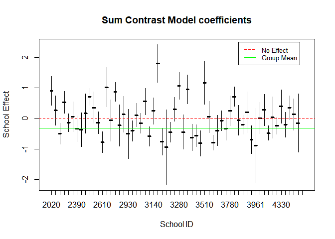
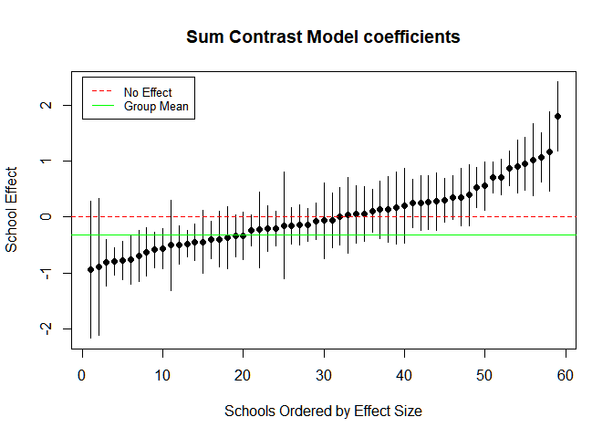

Using One Way ANOVA to Predict Group Effects
================
Andre Stephens
January 15, 2019

-   [The Data](#the-data)
-   [Formalizing the Model](#formalizing-the-model)
-   [Fitting the Model](#fitting-the-model)
-   [School Effect Sizes](#school-effect-sizes)
-   [Goodness-of-Fit](#goodness-of-fit)
-   [Intraclass Correlation](#intraclass-correlation)

The Data
========

we use data from the 1975 U.S. Sustaining Effects Study of elementary education, available as the `egsingle` dataset in the `mlmRev` R package. This gives data on 1,721 students in 60 schools. We will take `math` (Mathematics achievement score) as the outcome variable, and `schoolid` (the code for the school the student attends) as the grouping variable. For this example, we will use the data for year 0.5 only.

Formalizing the Model
=====================

Let *i* represent individual students in the set of students {1, 2, ..., *N*} and *k* represent individual schools in the set of schools {1, 2, ..., *J*}. Then, we can formalize the classical analysis of variance model for predicting scores using sum-constrast as follows:

<a href="https://www.codecogs.com/eqnedit.php?latex=$$&space;y_i&space;=&space;\hat{\alpha}_j&space;&plus;&space;\beta_1&space;x_{i,1}&space;&plus;&space;\beta_2&space;x_{i,2}&space;~&space;&plus;&space;~&space;...&space;~&space;&plus;&space;\beta_{J-1}&space;x_{i,J-1}&space;&plus;&space;\epsilon_i,&space;$$" target="_blank"></a>

and the intercept is given by,

<a href="https://www.codecogs.com/eqnedit.php?latex=\hat{\alpha}_j&space;\equiv&space;\tfrac{1}{J}&space;\sum_{k=1}^{J}&space;\overline{x}_j" target="_blank"></a>

and where,

<a href="https://www.codecogs.com/eqnedit.php?latex=y_i" target="_blank"></a> represents the mean score of school <a href="https://www.codecogs.com/eqnedit.php?latex=i" target="_blank"></a>, <a href="https://www.codecogs.com/eqnedit.php?latex=\hat{\alpha}_j" target="_blank"></a> represents the mean of school mean scores, <a href="https://www.codecogs.com/eqnedit.php?latex=\beta_k" target="_blank"></a> is the effect of the <a href="https://www.codecogs.com/eqnedit.php?latex=k^{th}" target="_blank"></a> school, representing the predicted deviation of that school from the overall mean, <a href="https://www.codecogs.com/eqnedit.php?latex=x_{i,k}" target="_blank"></a> is the <a href="https://www.codecogs.com/eqnedit.php?latex=i^{th}" target="_blank"></a> student in school <a href="https://www.codecogs.com/eqnedit.php?latex=k" target="_blank"></a>, and <a href="https://www.codecogs.com/eqnedit.php?latex=\epsilon_i" target="_blank"></a> is the stochastic component such that <a href="https://www.codecogs.com/eqnedit.php?latex=\epsilon&space;\sim&space;\mathcal{N}(0,\,\sigma^{2})" target="_blank"></a>.

Moreover, let <a href="https://www.codecogs.com/eqnedit.php?latex=k[i]" target="_blank"></a> represent the school to which the <a href="https://www.codecogs.com/eqnedit.php?latex=i^{th}" target="_blank"></a> student belongs. Then, the model has the following conditions for the orthogonal sum contrasts:

<a href="https://www.codecogs.com/eqnedit.php?latex=$\sum_{i=1}^{N}x_i&space;=&space;0$" target="_blank"></a>, 

<a href="https://www.codecogs.com/eqnedit.php?latex=\\x_{i,k[i]}&space;=&space;1&space;~&space;$if$~&space;k&space;\neq&space;J&space;\\&space;x_{i,J}&space;=&space;-1$,&space;otherwise&space;\\&space;$x_{i,k}&space;=&space;0" target="_blank"></a>

Fitting the Model
=================

Fitting the linear sum contrast model, we obtain estimates for how much the a school's average math score will deviate from the mean of all schools.

*The table shows coefficients for 10 schools from the sum contrast model of 60 schools.*

``` r
sum_contrast <- lm(math ~ C(factor(schoolid), contr="contr.sum"))
results <- summary(sum_contrast)

rename <- function(x){
  paste("School ID:", as.character(x), sep=" ")
}

names <- rename(unique(schoolid))
names <- c("Intercept", names)

n = 10
tab <- createTexreg(coef.names = names[1:n], 
                     coef = results$coefficients[,1][1:n], 
                     se=results$coefficients[,2][1:n],
                     pvalues = results$coefficients[,4][1:n],
                     model.name = "sum-contrast")

htmlreg(tab, caption = "Math Scores Sum Contrast Model (50 coefficients excluded)", 
    label = "Name", center=TRUE, caption.above = TRUE,custom.model.names = "Coefficents (SE)")
```

<!DOCTYPE HTML PUBLIC "-//W3C//DTD HTML 4.01 Transitional//EN" "http://www.w3.org/TR/html4/loose.dtd">
<table cellspacing="0" align="center" style="border: none;">
<caption align="top" style="margin-bottom:0.3em;">
Math Scores Sum Contrast Model (50 coefficients excluded)
</caption>
<tr>
<th style="text-align: left; border-top: 2px solid black; border-bottom: 1px solid black; padding-right: 12px;">
<b></b>
</th>
<th style="text-align: left; border-top: 2px solid black; border-bottom: 1px solid black; padding-right: 12px;">
<b>Coefficents (SE)</b>
</th>
</tr>
<tr>
<td style="padding-right: 12px; border: none;">
Intercept
</td>
<td style="padding-right: 12px; border: none;">
-0.31<sup style="vertical-align: 0px;">***</sup>
</td>
</tr>
<tr>
<td style="padding-right: 12px; border: none;">
</td>
<td style="padding-right: 12px; border: none;">
(0.03)
</td>
</tr>
<tr>
<td style="padding-right: 12px; border: none;">
School ID: 2020
</td>
<td style="padding-right: 12px; border: none;">
0.90<sup style="vertical-align: 0px;">***</sup>
</td>
</tr>
<tr>
<td style="padding-right: 12px; border: none;">
</td>
<td style="padding-right: 12px; border: none;">
(0.24)
</td>
</tr>
<tr>
<td style="padding-right: 12px; border: none;">
School ID: 2040
</td>
<td style="padding-right: 12px; border: none;">
0.26
</td>
</tr>
<tr>
<td style="padding-right: 12px; border: none;">
</td>
<td style="padding-right: 12px; border: none;">
(0.24)
</td>
</tr>
<tr>
<td style="padding-right: 12px; border: none;">
School ID: 2180
</td>
<td style="padding-right: 12px; border: none;">
-0.50<sup style="vertical-align: 0px;">**</sup>
</td>
</tr>
<tr>
<td style="padding-right: 12px; border: none;">
</td>
<td style="padding-right: 12px; border: none;">
(0.18)
</td>
</tr>
<tr>
<td style="padding-right: 12px; border: none;">
School ID: 2330
</td>
<td style="padding-right: 12px; border: none;">
0.53<sup style="vertical-align: 0px;">**</sup>
</td>
</tr>
<tr>
<td style="padding-right: 12px; border: none;">
</td>
<td style="padding-right: 12px; border: none;">
(0.18)
</td>
</tr>
<tr>
<td style="padding-right: 12px; border: none;">
School ID: 2340
</td>
<td style="padding-right: 12px; border: none;">
-0.14
</td>
</tr>
<tr>
<td style="padding-right: 12px; border: none;">
</td>
<td style="padding-right: 12px; border: none;">
(0.15)
</td>
</tr>
<tr>
<td style="padding-right: 12px; border: none;">
School ID: 2380
</td>
<td style="padding-right: 12px; border: none;">
0.06
</td>
</tr>
<tr>
<td style="padding-right: 12px; border: none;">
</td>
<td style="padding-right: 12px; border: none;">
(0.25)
</td>
</tr>
<tr>
<td style="padding-right: 12px; border: none;">
School ID: 2390
</td>
<td style="padding-right: 12px; border: none;">
-0.33
</td>
</tr>
<tr>
<td style="padding-right: 12px; border: none;">
</td>
<td style="padding-right: 12px; border: none;">
(0.22)
</td>
</tr>
<tr>
<td style="padding-right: 12px; border: none;">
School ID: 2440
</td>
<td style="padding-right: 12px; border: none;">
-0.37
</td>
</tr>
<tr>
<td style="padding-right: 12px; border: none;">
</td>
<td style="padding-right: 12px; border: none;">
(0.28)
</td>
</tr>
<tr>
<td style="padding-right: 12px; border: none;">
School ID: 2480
</td>
<td style="padding-right: 12px; border: none;">
0.16
</td>
</tr>
<tr>
<td style="padding-right: 12px; border-bottom: 2px solid black;">
</td>
<td style="padding-right: 12px; border-bottom: 2px solid black;">
(0.33)
</td>
</tr>
<tr>
<td style="padding-right: 12px; border: none;" colspan="3">
<span style="font-size:0.8em"><sup style="vertical-align: 0px;">***</sup>p &lt; 0.001, <sup style="vertical-align: 0px;">**</sup>p &lt; 0.01, <sup style="vertical-align: 0px;">*</sup>p &lt; 0.05</span>
</td>
</tr>
</table>


School Effect Sizes
===================

We can visualize the school effects by plotting the point estimates and the 95% confidence intervals. We also include the dotted red line which shows no school effect and the green line which represents the mean of school averages.

``` r
# Plot coefficients and confidence intervals
beta <- summary(sum_contrast)$coefficients[-1,1] # drop intercept
intercept <- summary(sum_contrast)$coefficients[1,1]
se <- summary(sum_contrast)$coefficients[-1,2]
lower <- beta - 1.96*se
upper <- beta + 1.96*se
beta_min <- min(lower)
beta_max <- max(upper)
n_beta <- length(beta)
schools <- unique(schoolid)[1:length(unique(schoolid))-1]

plot(schools, beta, ylim=c(beta_min, beta_max), pch=19,
     xlab="School ID", 
     ylab="School Effect", 
     main="Sum Contrast Model coefficients")

for (j in 1:n_beta){
  lines(x=c(j,j), y=c(lower[j], upper[j]))
}
abline(h=0, col="red", lwd=1.5, lty=2) # betas must sum to 0
abline(h=intercept, col="green", lwd=1.5) # group mean score
legend(45, 2.5, legend=c("No Effect", "Group Mean"),
       col=c("red", "green"), lty=2:1, cex=0.8)
```




We might also examine the school cofficients ordered by effect size.

``` r
# Plot coefficients and confidence intervals
plot(1:n_beta, beta[order(beta)], ylim=c(beta_min, beta_max), pch=19,
     xlab="Schools Ordered by Effect Size", 
     ylab="School Effect", 
     main="Sum Contrast Model coefficients")

for (j in 1:n_beta){
  jj <- order(beta)[j]
  lines(x=c(j,j), y=c(lower[jj], upper[jj]))
}
abline(h=0, col="red", lwd=1.5, lty=2) # betas sum to 0
abline(h=intercept, col="green", lwd=1.5) # group mean score
legend(0, 2.5, legend=c("No Effect", "Group Mean"),
       col=c("red", "green"), lty=2:1, cex=0.8)
```




We see that about a half of the schools are predicted to have a positive effect compared to the average school (red line). However, most schools have predicted group means above the mean of group means, suggesting that a few poorly-performing schools are skewing the results.

Goodness-of-Fit
===============

We can also carry out an F-test to determine how likely we are to observe these school effect sizes if schools actually have no effect on the scores (each school's average is predicted to be equal to the mean of school scores).

<a href="https://www.codecogs.com/eqnedit.php?latex=\\H_0&space;:&space;\beta_1&space;=&space;\beta_2&space;=&space;...&space;=&space;\beta_J&space;=&space;0&space;~$or$~&space;\overline{y}_{i,j}&space;=&space;\hat{\alpha}_j&space;\\&space;H_a&space;:&space;\beta_1&space;\neq&space;\beta_2&space;\neq&space;...&space;\neq&space;\beta_J&space;\neq&space;0&space;~$or$~&space;\overline{y}_{i,j}&space;\neq&space;\hat{\alpha}_j" target="_blank"></a>

The results show that we are significantly unlikely to observe these school effects (*F*<sub>59, 1612</sub>, *α* = 0.95) at predicting math scores than the intercept-only model (which assumes no school effects).

``` r
anova_test <- anova(sum_contrast)
anova_test
```

    ## Analysis of Variance Table
    ## 
    ## Response: math
    ##                                            Df  Sum Sq Mean Sq F value
    ## C(factor(schoolid), contr = "contr.sum")   59  480.73  8.1479  6.7698
    ## Residuals                                1612 1940.16  1.2036        
    ##                                             Pr(>F)    
    ## C(factor(schoolid), contr = "contr.sum") < 2.2e-16 ***
    ## Residuals                                             
    ## ---
    ## Signif. codes:  0 '***' 0.001 '**' 0.01 '*' 0.05 '.' 0.1 ' ' 1

``` r
p <- 0.95
df1 <- anova_test[1,1]
df2 <- anova_test[2,1]
qf(p, df1, df2) # critical value for F-test
```

    ## [1] 1.329398

In fact, if we examine the ratio of the school and residual sums of squares, we see that the variation in scores among schools accounts for about 20% of the total variation among student scores.

Intraclass Correlation
======================

The intraclass correlation is a useful statistic for how much of the overall variability in scores can be explained by school differences.

We calculate the within-school variance as follows:

<a href="https://www.codecogs.com/eqnedit.php?latex=$$SS_{within}&space;=&space;\frac{1}{N-J}&space;\sum_{k=1}^{J}&space;\sum_{i=1}^{n_k}&space;(x_{i,k}&space;-&space;\overline{x}_k)$$" target="_blank"></a>

``` r
mu_within <- tapply(math, schoolid, mean)
n_within <- tapply(math, schoolid, length)
n_between <- length(mu_within)

scores_grouped <- split(math, schoolid) # returns list of vectors of math scores by group

# estimate within-school variance
calc_variance <- function(j){
  sum( (j - mean(j))^2 )
}

vars <- sapply(scores_grouped, calc_variance)
sum_vars <- sum(vars)


var_within <- sum_vars/(length(math)-length(mu_within))
var_within
```

    ## [1] 1.203575

We calculate the within-school variance as follows:

<a href="https://www.codecogs.com/eqnedit.php?latex=$$SS_{between}&space;=&space;\frac{1}{J-1}&space;\sum_{k=1}^{J}&space;(\overline{x}_k&space;-&space;\frac{1}{J}&space;\sum_{k=1}^{J}\overline{x}_k)^2$$" target="_blank"></a>

``` r
# estimate between-schools variance
var_between <- sum( (mu_within - mean(mu_within))^2 )/(n_between-1)
var_between
```

    ## [1] 0.3312757

Then, the intraclass correlation coefficient is simply:

<a href="https://www.codecogs.com/eqnedit.php?latex=$$\rho&space;=&space;\frac{SS_{between}}{SS_{between}&space;&plus;&space;SS_{within}}$$" target="_blank"></a>

``` r
# estimate ICC
icc <- var_between/(var_between + var_within)
icc
```

    ## [1] 0.2158358
